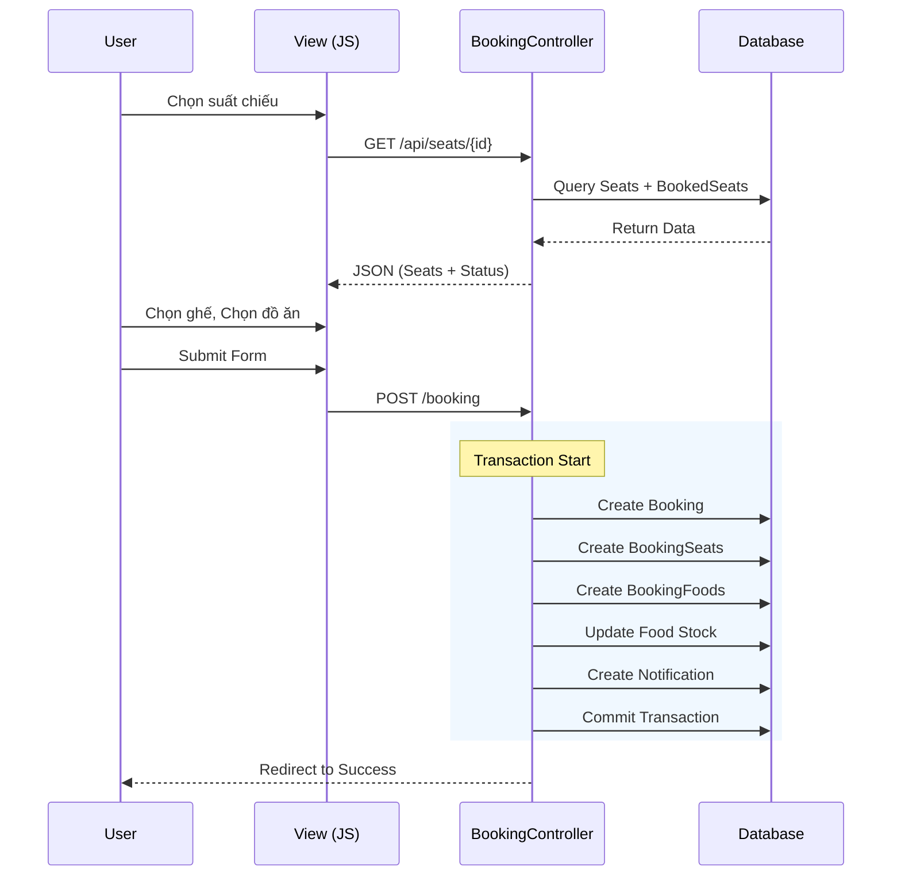

# TÀI LIỆU PHÂN TÍCH DỰ ÁN MOVIE BOOKING

Tài liệu này tổng hợp toàn bộ phân tích về luồng hoạt động (User Flows) và chi tiết kỹ thuật (Technical Deep Dive) của dự án.

---

# PHẦN 1: CÁC LUỒNG HOẠT ĐỘNG CHÍNH

Dựa trên cấu trúc routes và mã nguồn hiện tại, dưới đây là mô tả chi tiết các luồng hoạt động chính của hệ thống:

## 1. Phân Quyền & Xác Thực (Authentication & Authorization)
Hệ thống chia làm 2 nhóm người dùng chính: **Khách hàng (Client)** và **Quản trị viên (Admin)**.

*   **Đăng ký/Đăng nhập:**
    *   Khách truy cập có thể đăng ký tài khoản mới (`/register`).
    *   Đăng nhập vào hệ thống (`/login`).
    *   Sau khi đăng nhập, người dùng thường có thể truy cập trang Hồ sơ cá nhân (`/profile`) để cập nhật thông tin hoặc ảnh đại diện.
*   **Logout:** Đăng xuất khỏi hệ thống (`/logout`).
*   **Admin:** Các chức năng quản trị được bảo vệ bởi middleware `admin`, yêu cầu tài khoản phải có quyền quản trị mới truy cập được.

## 2. Luồng Người Dùng (Client Flows)

Đây là luồng chính dành cho khách hàng muốn tìm kiếm phim và đặt vé.

### A. Tra cứu & Tìm kiếm
*   **Trang chủ (`/`):** Hiển thị danh sách phim đang chiếu, sắp chiếu, slider, tin tức nổi bật. Có chức năng **Đặt vé nhanh** (chọn Phim -> Rạp -> Ngày -> Suất).
*   **Danh sách phim (`/movies`):** Xem toàn bộ phim.
*   **Chi tiết phim (`/movie/{id}`):** Xem thông tin chi tiết của một bộ phim (nội dung, trailer, diễn viên) và các suất chiếu có sẵn.
*   **Tin tức (`/posts`):** Xem các bài viết, khuyến mãi.
*   **Thông tin Rạp (`/theaters/{id}`):** Xem thông tin chi tiết về cụm rạp.

### B. Luồng Đặt Vé (Booking Process)
1.  **Chọn Suất Chiếu:**
    *   Từ trang chủ (Đặt vé nhanh) hoặc trang chi tiết phim, người dùng chọn Phim, Rạp, Ngày và Giờ chiếu.
    *   Hệ thống sử dụng các API (`/api/cinemas-by-movie`, `/api/dates`, `/api/showtimes`) để lọc dữ liệu động.
2.  **Chọn Ghế & Đồ ăn (`/booking/{showtime_id}`):**
    *   Người dùng được chuyển đến giao diện sơ đồ ghế (`/api/seats/...`).
    *   Chọn vị trí ghế ngồi mong muốn (Ghế thường, VIP, Đôi).
    *   Chọn thêm đồ ăn/nước uống (`/api/foods`) nếu có nhu cầu.
3.  **Thanh toán & Xác nhận:**
    *   Kiểm tra lại thông tin vé.
    *   Xác nhận đặt vé (`POST /booking`). Hệ thống yêu cầu đăng nhập nếu chưa đăng nhập.
    *   Sau khi xử lý thành công, chuyển hướng đến trang **Thành công** (`/booking/success/{id}`) hiển thị mã vé.

### C. Cá nhân
*   **Hồ sơ (`/profile`):** Xem và sửa thông tin cá nhân.
*   **Lịch sử giao dịch:** (Thường nằm trong trang profile - hiển thị các vé đã đặt).
*   **Thông báo (`/notifications`):** Nhận các thông báo từ hệ thống.

## 3. Luồng Quản Trị (Admin Flows)

Dành cho quản trị viên để vận hành hệ thống, truy cập qua đường dẫn `/admin`.

*   **Dashboard (`/admin`):** Xem báo cáo tổng quan, thống kê doanh thu/lượng vé.
*   **Quản lý Phim (`/admin/movies`):** Thêm, sửa, xóa phim, cập nhật trạng thái (đang chiếu/sắp chiếu).
*   **Quản lý Rạp & Phòng (`/admin/cinemas`, `/admin/rooms`):**
    *   Quản lý danh sách rạp chiếu.
    *   Thiết lập sơ đồ ghế cho từng phòng (`/admin/rooms/{id}/seats-honeycomb`).
*   **Quản lý Suất chiếu (`/admin/showtimes`):** Lên lịch chiếu phim cho các phòng và khung giờ cụ thể.
*   **Quản lý Đặt vé (`/admin/bookings`):** Xem danh sách vé đã đặt, hỗ trợ hủy vé hoặc xóa vé.
*   **Quản lý Post/Tin tức (`/admin/posts`):** Đăng tải bài viết tin tức, khuyến mãi.
*   **Quản lý Người dùng (`/admin/users`):** Xem danh sách người dùng, chặn/mở khóa tài khoản.
*   **Quản lý Đồ ăn (`/admin/foods`):** Quản lý menu bắp nước.

## 4. API & Ajax (Hậu trường)
Hệ thống sử dụng nhiều API nội bộ (`/api/...`) để phục vụ các thao tác không cần tải lại trang, đặc biệt quan trọng trong:
*   Mục "Đặt vé nhanh" ở trang chủ (Lazy loading danh sách rạp/ngày/suất).
*   Trang "Chọn ghế" (Cập nhật trạng thái ghế realtime hoặc load sơ đồ ghế).
*   Tìm kiếm phim tự động (`/api/search-movie`).

---

# PHẦN 2: PHÂN TÍCH KỸ THUẬT CHUYÊN SÂU (TECHNICAL DEEP DIVE)

Tài liệu này đi sâu vào cách thức hoạt động (implementation details) của các luồng chính trong hệ thống, bao gồm logic xử lý tại Controller và tương tác Frontend.

## 1. Luồng Đặt Vé (Booking Flow)

Đây là quy trình phức tạp nhất, được xử lý chính bởi `BookingController` và `create.blade.php`.

### Quy trình chi tiết:

1.  **Bước 1: Khởi tạo (`BookingController@create`)**
    *   Nhận `showtime_id`.
    *   Load thông tin `Showtime` cùng với quan hệ: `movie`, `room`, `cinema`.
    *   Trả về view `bookings.create`.

2.  **Bước 2: Chọn Ghế (Client-Side Logic)**
    *   Frontend gọi API Ajax: `GET /api/seats/{showtime_id}`.
    *   **Backend (`BookingController@getSeats`):**
        *   Lấy danh sách tất cả ghế của phòng chiếu.
        *   Truy vấn bảng `booking_seats` để lấy danh sách các ghế **đang có trong các booking active** của suất chiếu này (`bookedSeatIds`).
        *   Trả về JSON: danh sách ghế + cờ `is_occupied` (true nếu ID ghế nằm trong `bookedSeatIds`).
    *   **Frontend:**
        *   Render lưới ghế (10 ghế/hàng).
        *   Nếu ghế có `is_occupied = true`, disable click và hiển thị màu xám.
        *   Khi người dùng click ghế trống, thêm ID vào mảng `selectedSeats`.

3.  **Bước 3: Xử lý Đặt vé (`BookingController@store`)**
    *   **Validation:** Kiểm tra `showtime_id`, `seat_ids` (mảng), `foods` (nếu có).
    *   **Transaction:** Bắt đầu transaction DB để đảm bảo tính toàn vẹn.
    *   **Tính toán:**
        *   `Total Price = (Giá vé * Số ghế) + (Giá món * Số lượng)`.
    *   **Lưu dữ liệu:**
        1.  Tạo bản ghi `bookings`.
        2.  Tạo các bản ghi `booking_seats` (lưu giá vé tại thời điểm đặt).
        3.  Tạo các bản ghi `booking_foods` (nếu có).
        4.  **Trừ kho:** Giảm số lượng tồn kho của món ăn (`Food::decrement`).
    *   **Thông báo:** Tạo bản ghi `notifications` cho người dùng.
    *   **Commit:** Lưu transaction.

### Mermaid Diagram - Booking Process

## 2. Luồng Tìm Kiếm Ajax (Search Flow)

Hệ thống sử dụng mô hình "Phụ thuộc tầng" (Cascading Dropdowns) để lọc suất chiếu ở Trang chủ. Logic nằm trong `HomeController`.

### Cơ chế hoạt động:

1.  **Input:** Người dùng chọn Phim.
2.  **API `getCinemasByMovie`:**
    *   Logic: Tìm `Cinema` có `Room` có `Showtime` mà `movie_id` trùng khớp.
    *   Query: `Cinema::whereHas('rooms.showtimes', ...)`
3.  **Input:** Người dùng chọn Rạp.
4.  **API `getRooms`:**
    *   Logic: Lấy danh sách `Room` thuộc `cinema_id`.
    *   Lưu ý: Logic này hiện tại hơi lỏng, chỉ lấy phòng của rạp, chưa filter xem phòng đó có chiếu phim đã chọn hay không (dù thường là có, nhưng chặt chẽ hơn nên filter tiếp).
5.  **Input:** Người dùng chọn Ngày.
6.  **API `getDates`:**
    *   Logic: Tìm các `date_start` duy nhất trong bảng `Showtime` khớp `movie_id` và `room_id`.
7.  **Input:** Người dùng nhấn Tìm.
8.  **API `searchShowtime`:**
    *   Logic: Lấy chi tiết suất chiếu khớp cả 3 điều kiện: `movie`, `room`, `date`.

## 3. Luồng Quản trị & Đồng bộ Phòng (Admin Room Logic)

Logic thú vị nằm ở `RoomAdminController`, đặc biệt là cách xử lý ghế khi tạo/sửa phòng.

### Logic Tự động tạo ghế (`store` & `update`):
*   Khi Admin tạo phòng với "Tổng số ghế" (`total_seats`), hệ thống **tự động sinh ra các bản ghi Seat**.
*   **Quy tắc đặt tên ghế:** `TênPhòng` + `Số thứ tự (padded 2 số)`. Ví dụ: `RoomA01`, `RoomA02`...
*   **Khi cập nhật (`update`):**
    *   Nếu `new_total > old_total`: Loop từ `old+1` đến `new`, tạo thêm ghế mới.
    *   Nếu `new_total < old_total`: Xóa bớt các ghế có số thứ tự lớn nhất (`orderBy desc limit diff`).
    *   Cách này giúp giữ nguyên ID của các ghế cũ, không làm hỏng dữ liệu booking lịch sử (trừ khi xoá bớt ghế đã từng được đặt).

### Sơ đồ ghế Honeycomb (`showSeatsHoneycomb`)
*   Mặc dù tên hàm là `Honeycomb`, logic thực tế đang chia ghế theo hàng (Rows) dựa trên tham số `seats_per_row` (mặc định 10).
*   Controller tính toán `rowIndex` cho từng ghế để Frontend hiển thị từng hàng.
*   Nó cũng preload thông tin `booking` mới nhất của từng ghế để Admin biết ghế nào đang được ai đặt (rất hữu ích cho việc check-in hoặc kiểm tra sự cố).

## 4. Luồng Xác Thực (Auth Logic)

Xử lý tại `AuthController`.

*   **Role Logic:** Mặc định khi đăng ký (`register`), user có `role = 1` (Khách hàng) và `status = 1` (Active).
*   **Incomplete Profile Check:**
    *   Sau khi đăng nhập (`login`), hệ thống kiểm tra 3 trường: `name`, `phone`, `address`.
    *   Nếu thiếu 1 trong 3, user bị Force Redirect về trang `/profile` để cập nhật. Đây là một logic nghiệp vụ cứng (Business Rule).

## 5. Quản lý Lịch Chiếu (Showtime Management)

Xử lý tại `ShowtimeAdminController`.

*   **Cấu trúc dữ liệu:**
    *   1 Suất chiếu (`Showtime`) gắn với 1 Phim, 1 Phòng và 1 Khung giờ cụ thể (`date_start` + `start_time`).
    *   **Lọc dữ liệu (Filtering):** Trang danh sách hỗ trợ lọc theo 3 tiêu chí cùng lúc: Phim, Rạp (thông qua relationship `room.cinema`), và Ngày chiếu.
    *   **Lưu ý:** Hiện tại logic `store` chưa có kiểm tra "Trùng suất chiếu" (Overlapping check). Nếu Admin set 2 phim cùng giờ trong 1 phòng, hệ thống vẫn cho phép (có thể gây lỗi khi đặt vé).

## 6. Quản lý Phim (Movie Logic)

Xử lý tại `MovieAdminController`.

*   **Thể loại (Genre):**
    *   Dữ liệu từ form gửi lên là chuỗi string phân tách dấu phẩy (ví dụ: "Hành động, Hài").
    *   Controller dùng `explode(',', $string)` để chuyển thành mảng trước khi lưu vào DB (Model có lẽ đã cast attribute này thành JSON hoặc Array).
*   **Poster:** File upload được lưu vào `uploads/posters` với tên file unique (`time() + original_name`).

## 7. Các Chức Năng Khác

### Dashboard Thống Kê (`AdminController@dashboard`)
*   Sử dụng các hàm aggregate cơ bản của Eloquent: `count()`, `sum()`.
*   **Phim phổ biến:** Tính dựa trên `withCount('showtimes')` (đếm số lượng suất chiếu), sau đó order descending. Điều này có nghĩa là phim nào được xếp lịch chiếu nhiều nhất sẽ được coi là "phổ biến" (logic này có thể cần cải thiện để tính theo số vé bán ra).

### Quản lý Đồ ăn (`FoodAdminController`)
*   **Upload Ảnh:**
    *   Ảnh được lưu vào `public/uploads/foods`.
    *   **Logic Xóa ảnh cũ:** Khi cập nhật món ăn, nếu có upload ảnh mới, hệ thống kiểm tra và xóa file ảnh cũ bằng `unlink` để dọn dẹp bộ nhớ server. Đây là một điểm plus về tối ưu resource.
*   **Tồn kho:** Controller có trường `total` (tổng số lượng). Khi đặt vé (`BookingController`), số lượng này bị trừ đi. Admin có thể cập nhật lại số lượng này.

### Thông báo (`NotificationController`)
*   Sử dụng quan hệ `HasMany` mặc định của Laravel (`$user->notifications()`).
*   Có API `/unreadCount` trả về JSON để Frontend hiển thị số lượng thông báo chưa đọc trên Header (Ajax polling hoặc load khi trang tải).
